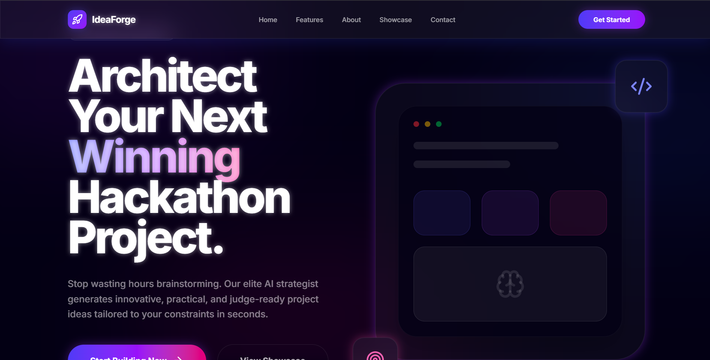
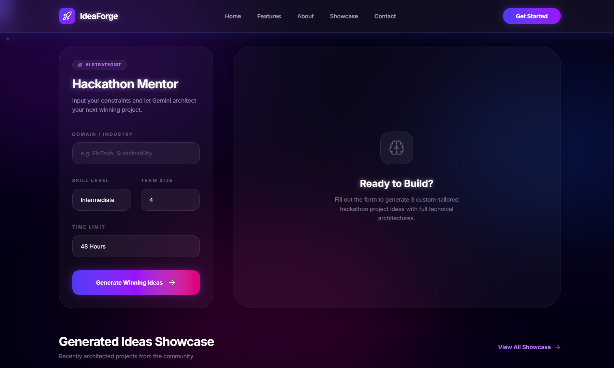
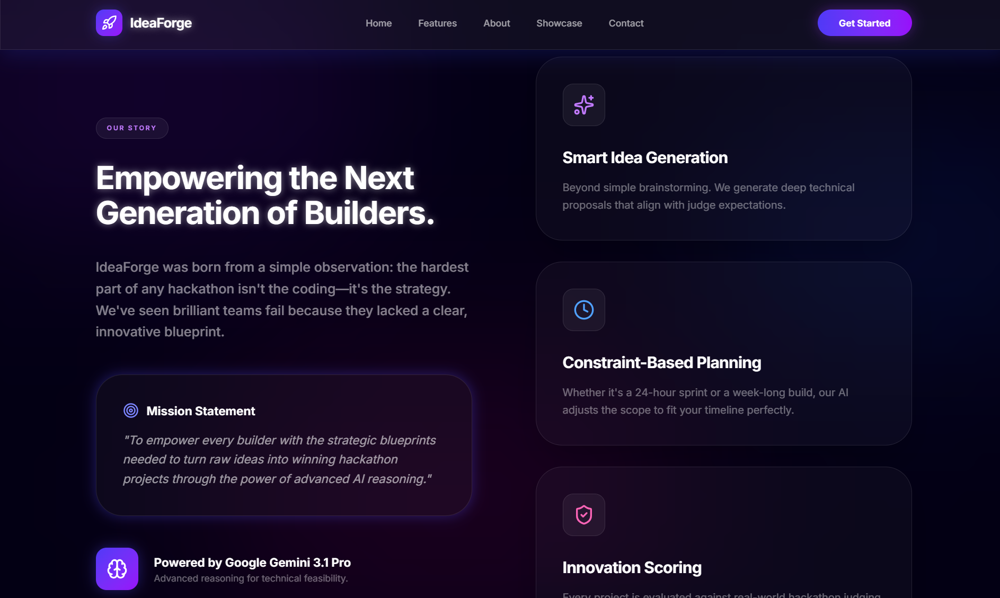
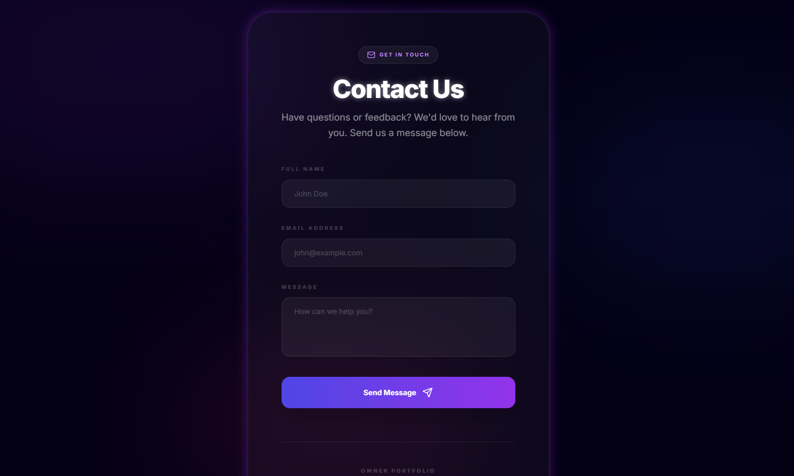

# 1. Project Title
## IdeaForge
AI-powered hackathon ideation platform that turns constraints into judge-ready project blueprints.

# 2. Elevator Pitch
From blank page to winning hackathon blueprint in seconds.

# 3. Overview
IdeaForge helps developers and teams quickly generate high-quality hackathon project ideas with clear technical architecture, feature scope, and execution plans.

The platform is designed for:
- Hackathon participants who need direction fast
- Judges and mentors who want structured, realistic ideas
- Contributors building AI-powered developer tooling

IdeaForge's core value is speed + strategy: it does not just brainstorm titles, it produces practical, buildable concepts aligned to team skill, time limits, and domain focus.

# 4. Features
- AI-generated hackathon ideas tailored to domain/industry, skill level, team size, and time constraints
- Structured project output with one-line pitch, problem statement, core features, technical architecture, development roadmap, and winning-potential scoring
- Idea showcase for browsing generated concepts
- Blueprint view for detailed project planning
- PDF export for sharing and presentation
- Fully working Contact Us system with backend validation and email delivery
- Responsive UI with consistent branding across pages

# 5. How It Works
1. User enters constraints in the IdeaForge form.
2. Frontend sends inputs to the Gemini integration layer.
3. Prompt-engineering templates guide Google Gemini API to return structured, hackathon-relevant outputs.
4. App parses and renders ideas into cards, showcase entries, and detailed blueprints.
5. Users refine, review, export, and share ideas.

Prompt engineering is a key differentiator:
- Prompts are designed to enforce practical, implementation-focused responses.
- Outputs are optimized for hackathon judging criteria (impact, feasibility, innovation, clarity).
- The model is guided to provide architecture-level reasoning, not generic text.

# 6. Technology Stack
## Built With
- Frontend: React 19, TypeScript, Vite, Tailwind CSS, Motion, React Router
- Backend: Node.js, Express, Nodemailer, Express Rate Limit, CORS, JSON middleware
- AI: Google Gemini API with prompt engineering for structured idea generation

# 7. Screenshots







# 8. Installation / Demo Instructions
## Prerequisites
- Node.js 18+
- npm
- Google Gemini API key
- SMTP credentials (for Contact Us email delivery)

## Setup
1. Clone the repository.
2. Install dependencies:
   ```bash
   npm install
   ```
3. Create a local environment file from the example:
   ```bash
   cp .env.example .env
   ```
4. Configure required values in `.env`: `GEMINI_API_KEY`, `PORT`, `CORS_ORIGIN`, `SMTP_USER`, `SMTP_PASS`, SMTP host/service settings, `CONTACT_TO_EMAIL`, and `CONTACT_FROM_EMAIL`.

## Run (Local Demo)
1. Start backend:
   ```bash
   npm run server
   ```
2. Start frontend (new terminal):
   ```bash
   npm run dev
   ```
3. Open frontend at `http://localhost:3000` and backend health check at `http://localhost:5000/api/health`.

## Production Build
```bash
npm run build
```

# 9. Usage
1. Open IdeaForge home page.
2. Click `Get Started` / `Start Building Now`.
3. Enter hackathon constraints (domain, skill level, team size, timeline).
4. Generate ideas and review winning-potential scores.
5. Open `Showcase` to browse saved ideas.
6. Open any `Blueprint` for full architecture details.
7. Export concept to PDF for submission decks.
8. Use `Contact Us` for support or collaboration.

# 10. Contact / Support
- Product support: use the Contact Us form (`/contact.html`)
- Email: `ayush.yadav130710@gmail.com`
- Portfolio: [https://ayush-yadav.vercel.app/](https://ayush-yadav.vercel.app/)

If you are a contributor, open an issue/PR with:
- Reproduction steps
- Expected vs actual behavior
- Screenshots or logs where possible

# 11. License
No license file is currently included in this repository.

For open-source distribution, add a `LICENSE` file (MIT is a common choice for hackathon/demo projects).
